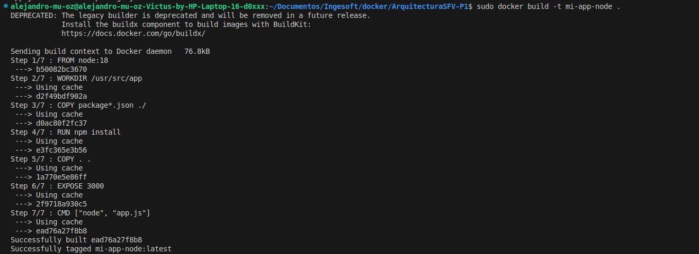
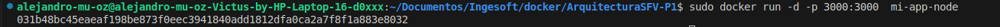

# ArquitecturaSFV-P1

# Evaluación Práctica - Ingeniería de Software V

## Información del Estudiante
- **Nombre:** Jose Alejandro Muñoz Ceron    
- **Código:** A00395672 
- **Fecha:** 6 agosto 2025

## Resumen de la Solución
Primero, dentro del directorio del proyecto llamado ArquitecturaSFV-P1, se creó un archivo llamado Dockerfile. Este archivo contiene las instrucciones necesarias para que Docker pueda construir una imagen de la aplicación. En él, se utilizó la imagen base oficial de Node.js versión 18 (node:18) como punto de partida. Luego, se definió un directorio de trabajo dentro del contenedor (/usr/src/app), y se copiaron los archivos package.json y package-lock.json para instalar las dependencias con npm install. Posteriormente, se copió el resto de los archivos de la aplicación, se expuso el puerto 3000 (que es donde se espera que la aplicación escuche), y se definió el comando para ejecutar la app con node app.js

## Dockerfile
Se utilizó la imagen oficial node:18 como base, ya que es una versión estable y ampliamente soportada.
Se estableció /usr/src/app como directorio de trabajo para mantener organizada la aplicación dentro del contenedor.
Se copiaron los archivos package*.json primero para aprovechar la caché de Docker y acelerar futuras construcciones.
Luego se ejecutó npm install para instalar las dependencias necesarias.
Después se copiaron todos los archivos restantes del proyecto al contenedor.
Se expuso el puerto 3000, que es donde la aplicación escucha las peticiones.
Finalmente, se usó el comando node app.js como punto de entrada para ejecutar la aplicación cuando se inicia el contenedor.

## Script de Automatización
[Describe cómo funciona tu script y las funcionalidades implementadas]

## Principios DevOps Aplicados
1. [Principio 1]
2. [Principio 2]
3. [Principio 3]

## Captura de Pantalla



## Mejoras Futuras
* Uso de docker-compose para múltiples servicios
* Implementación de entorno de desarrollo con nodemon
* Creación de imágenes multietapa (multi-stage build)


## Instrucciones para Ejecutar

Las instrucciones son utilizadas para el sistema operativo LINUX si deseas implementarlo en Windows necesitas borrar la palabra "sudo" en cada comando

1. **Ubicarse en la carpeta del proyecto**
   Abre la terminal y navega hasta el directorio donde se encuentra el proyecto:

   ```bash
   cd ~/Documentos/Ingesoft/docker/ArquitecturaSFV-P1
   ```
2. **Construir la imagen de Docker**
    El siguiente comando para construir la imagen:

   ```bash
   sudo docker build -t mi-app-node .
   ```

4. **Ejecutar el contenedor**
   Una vez construida la imagen, ejecutamos el contenedor mapeando en el puerto:

   ```bash
   sudo docker run -d -p 3000:3000  mi-app-node
   ```

5. **Abrir la aplicación en el navegador**
   Accede desde tu navegador a:

   ```
   http://localhost:3000
   ```

   Ahí deberías ver tu aplicación funcionando correctamente.


